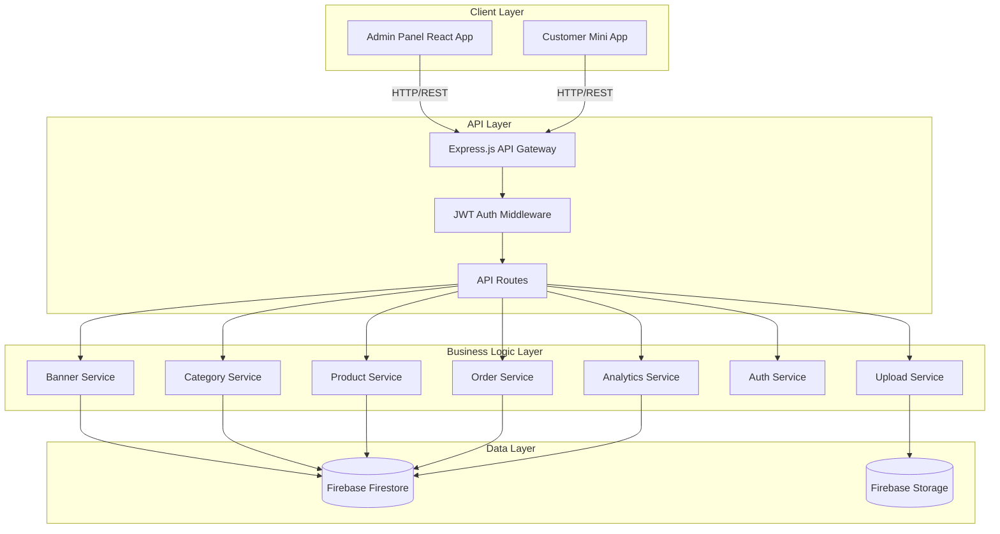
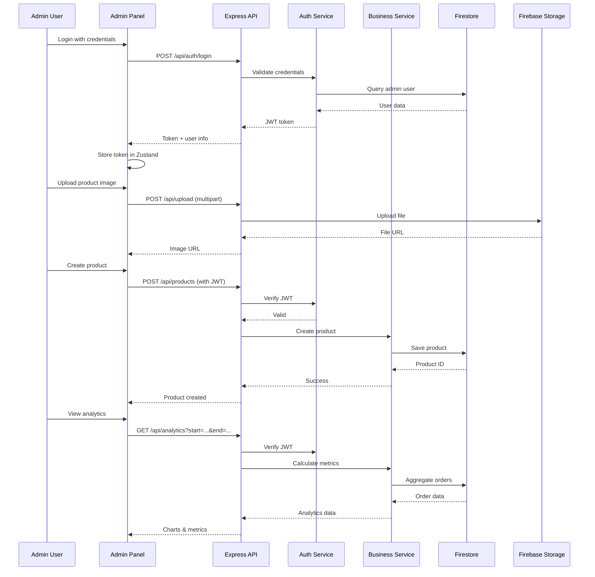

# Design Document: Admin Panel & Backend Integration

## Overview

This feature implements a comprehensive admin panel with backend integration for managing a fast food delivery application. The system enables administrators to manage advertisements, categories, products, and orders through a React-based admin interface, while providing RESTful APIs for data operations. The backend uses Express.js with Firebase Firestore for data persistence and Firebase Storage for image uploads. The admin panel includes analytics dashboards with charts and export capabilities, JWT-based authentication, and real-time order management with status tracking.

## Architecture

The system follows a three-tier architecture with clear separation between presentation (React Admin Panel), business logic (Express.js API), and data persistence (Firebase Firestore). The frontend communicates with the backend via RESTful APIs, while the backend handles authentication, data validation, and Firebase operations.




## Main Workflow



## Components and Interfaces

### Backend Components

#### 1. Authentication Service

**Purpose**: Handles admin authentication and JWT token management

**Interface**:
```typescript
interface IAuthService {
  login(email: string, password: string): Promise<AuthResult>;
  verifyToken(token: string): Promise<AdminUser>;
  hashPassword(password: string): Promise<string>;
  comparePassword(password: string, hash: string): Promise<boolean>;
}

interface AuthResult {
  success: boolean;
  token?: string;
  user?: AdminUser;
  message?: string;
}

interface AdminUser {
  id: string;
  email: string;
  name: string;
  role: 'admin' | 'super_admin';
  createdAt: Date;
}
```

**Responsibilities**:
- Validate admin credentials against Firestore
- Generate JWT tokens with expiration
- Verify and decode JWT tokens
- Hash passwords using bcrypt
- Manage admin user sessions


#### 2. Banner Service

**Purpose**: Manages advertisement banners for the homepage

**Interface**:
```typescript
interface IBannerService {
  createBanner(data: CreateBannerDto): Promise<Banner>;
  updateBanner(id: string, data: UpdateBannerDto): Promise<Banner>;
  deleteBanner(id: string): Promise<void>;
  getBanners(filters?: BannerFilters): Promise<Banner[]>;
  getBannerById(id: string): Promise<Banner | null>;
  toggleBannerStatus(id: string, isActive: boolean): Promise<Banner>;
}

interface Banner {
  id: string;
  title: string;
  description: string;
  imageUrl: string;
  ctaText: string;
  ctaLink?: string;
  isActive: boolean;
  order: number;
  createdAt: Date;
  updatedAt: Date;
}

interface CreateBannerDto {
  title: string;
  description: string;
  imageUrl: string;
  ctaText: string;
  ctaLink?: string;
  order?: number;
}

interface UpdateBannerDto extends Partial<CreateBannerDto> {
  isActive?: boolean;
}

interface BannerFilters {
  isActive?: boolean;
  limit?: number;
}
```

**Responsibilities**:
- CRUD operations for banners
- Validate banner data
- Manage banner ordering
- Toggle active/inactive status
- Query active banners for customer app

#### 3. Category Service

**Purpose**: Manages product categories

**Interface**:
```typescript
interface ICategoryService {
  createCategory(data: CreateCategoryDto): Promise<Category>;
  updateCategory(id: string, data: UpdateCategoryDto): Promise<Category>;
  deleteCategory(id: string): Promise<void>;
  getCategories(filters?: CategoryFilters): Promise<Category[]>;
  getCategoryById(id: string): Promise<Category | null>;
  reorderCategories(orders: Array<{id: string, order: number}>): Promise<void>;
}

interface Category {
  id: string;
  name: string;
  description: string;
  imageUrl: string;
  order: number;
  isActive: boolean;
  productCount: number;
  createdAt: Date;
  updatedAt: Date;
}

interface CreateCategoryDto {
  name: string;
  description: string;
  imageUrl: string;
  order?: number;
}

interface UpdateCategoryDto extends Partial<CreateCategoryDto> {
  isActive?: boolean;
}

interface CategoryFilters {
  isActive?: boolean;
  search?: string;
}
```

**Responsibilities**:
- CRUD operations for categories
- Validate category data
- Manage category ordering
- Track product count per category
- Prevent deletion of categories with products


#### 4. Product Service

**Purpose**: Manages products and inventory

**Interface**:
```typescript
interface IProductService {
  createProduct(data: CreateProductDto): Promise<Product>;
  updateProduct(id: string, data: UpdateProductDto): Promise<Product>;
  deleteProduct(id: string): Promise<void>;
  getProducts(filters?: ProductFilters): Promise<PaginatedProducts>;
  getProductById(id: string): Promise<Product | null>;
  updateStock(id: string, quantity: number): Promise<Product>;
}

interface Product {
  id: string;
  name: string;
  description: string;
  price: number;
  imageUrl: string;
  categoryId: string;
  categoryName: string;
  isActive: boolean;
  inStock: boolean;
  stockQuantity?: number;
  createdAt: Date;
  updatedAt: Date;
}

interface CreateProductDto {
  name: string;
  description: string;
  price: number;
  imageUrl: string;
  categoryId: string;
  stockQuantity?: number;
}

interface UpdateProductDto extends Partial<CreateProductDto> {
  isActive?: boolean;
  inStock?: boolean;
}

interface ProductFilters {
  categoryId?: string;
  isActive?: boolean;
  inStock?: boolean;
  search?: string;
  page?: number;
  limit?: number;
}

interface PaginatedProducts {
  products: Product[];
  total: number;
  page: number;
  totalPages: number;
}
```

**Responsibilities**:
- CRUD operations for products
- Validate product data and pricing
- Manage product stock levels
- Filter and search products
- Paginate product listings
- Validate category existence

#### 5. Order Service

**Purpose**: Manages customer orders and order lifecycle

**Interface**:
```typescript
interface IOrderService {
  createOrder(data: CreateOrderDto): Promise<Order>;
  updateOrderStatus(id: string, status: OrderStatus, note?: string): Promise<Order>;
  getOrders(filters?: OrderFilters): Promise<PaginatedOrders>;
  getOrderById(id: string): Promise<Order | null>;
  getOrderHistory(id: string): Promise<OrderHistoryEntry[]>;
  cancelOrder(id: string, reason: string): Promise<Order>;
}

interface Order {
  id: string;
  orderNumber: string;
  items: OrderItem[];
  totalAmount: number;
  customerInfo: CustomerInfo;
  paymentMethod: 'cash' | 'card' | 'online';
  status: OrderStatus;
  comment?: string;
  createdAt: Date;
  updatedAt: Date;
  statusHistory: OrderHistoryEntry[];
}

interface OrderItem {
  productId: string;
  productName: string;
  quantity: number;
  price: number;
  subtotal: number;
}

interface CustomerInfo {
  name: string;
  phone: string;
  address: string;
  telegramUserId?: number;
}

type OrderStatus = 'pending' | 'confirmed' | 'preparing' | 'delivering' | 'completed' | 'cancelled';

interface OrderHistoryEntry {
  status: OrderStatus;
  timestamp: Date;
  note?: string;
  updatedBy?: string;
}

interface CreateOrderDto {
  items: Array<{productId: string, quantity: number}>;
  customerInfo: CustomerInfo;
  paymentMethod: 'cash' | 'card' | 'online';
  comment?: string;
}

interface OrderFilters {
  status?: OrderStatus;
  startDate?: Date;
  endDate?: Date;
  search?: string;
  page?: number;
  limit?: number;
}

interface PaginatedOrders {
  orders: Order[];
  total: number;
  page: number;
  totalPages: number;
}
```

**Responsibilities**:
- Create orders with validation
- Update order status with history tracking
- Generate unique order numbers
- Calculate order totals
- Filter orders by date, status, customer
- Maintain order status history
- Handle order cancellations


#### 6. Analytics Service

**Purpose**: Generates business metrics and reports

**Interface**:
```typescript
interface IAnalyticsService {
  getDashboardMetrics(startDate: Date, endDate: Date): Promise<DashboardMetrics>;
  getOrdersOverTime(startDate: Date, endDate: Date, groupBy: 'day' | 'week' | 'month'): Promise<TimeSeriesData[]>;
  getRevenueOverTime(startDate: Date, endDate: Date, groupBy: 'day' | 'week' | 'month'): Promise<TimeSeriesData[]>;
  getTopProducts(startDate: Date, endDate: Date, limit: number): Promise<ProductStats[]>;
  exportReport(startDate: Date, endDate: Date, format: 'csv' | 'pdf'): Promise<Buffer>;
}

interface DashboardMetrics {
  totalOrders: number;
  totalRevenue: number;
  averageOrderValue: number;
  completedOrders: number;
  pendingOrders: number;
  cancelledOrders: number;
  topProducts: ProductStats[];
  revenueGrowth: number;
  orderGrowth: number;
}

interface TimeSeriesData {
  date: string;
  value: number;
  label?: string;
}

interface ProductStats {
  productId: string;
  productName: string;
  totalOrders: number;
  totalQuantity: number;
  totalRevenue: number;
}
```

**Responsibilities**:
- Calculate key business metrics
- Aggregate order data by time periods
- Generate time-series data for charts
- Identify top-selling products
- Calculate growth percentages
- Export reports in CSV/PDF formats

#### 7. Upload Service

**Purpose**: Handles file uploads to Firebase Storage

**Interface**:
```typescript
interface IUploadService {
  uploadImage(file: Express.Multer.File, folder: string): Promise<string>;
  deleteImage(imageUrl: string): Promise<void>;
  validateImage(file: Express.Multer.File): ValidationResult;
}

interface ValidationResult {
  valid: boolean;
  error?: string;
}
```

**Responsibilities**:
- Upload images to Firebase Storage
- Generate unique filenames
- Validate file types and sizes
- Delete images from storage
- Return public URLs

### Frontend Components (Admin Panel)

#### 1. Authentication Store (Zustand)

**Purpose**: Manages authentication state

**Interface**:
```typescript
interface AuthStore {
  user: AdminUser | null;
  token: string | null;
  isAuthenticated: boolean;
  login: (email: string, password: string) => Promise<void>;
  logout: () => void;
  checkAuth: () => void;
}
```

#### 2. Layout Component

**Purpose**: Provides consistent layout with navigation

**Interface**:
```typescript
interface LayoutProps {
  children: React.ReactNode;
}
```

**Features**:
- Sidebar navigation
- Header with user info
- Logout button
- Active route highlighting


#### 3. Dashboard Page

**Purpose**: Displays key metrics and charts

**Features**:
- Metric cards (total orders, revenue, avg order value)
- Date range picker
- Orders over time chart (Line chart)
- Revenue over time chart (Bar chart)
- Top products table
- Real-time updates

#### 4. Banners Page

**Purpose**: Manage advertisement banners

**Features**:
- Banner list with preview
- Create/Edit banner modal
- Image upload with preview
- Toggle active/inactive
- Reorder banners (drag & drop)
- Delete confirmation

#### 5. Categories Page

**Purpose**: Manage product categories

**Features**:
- Category grid with images
- Create/Edit category modal
- Image upload
- Reorder categories
- Product count display
- Delete with validation

#### 6. Products Page

**Purpose**: Manage products

**Features**:
- Product table with filters
- Search by name
- Filter by category, status
- Create/Edit product modal
- Image upload
- Stock management
- Bulk actions (activate/deactivate)
- Pagination

#### 7. Orders Page

**Purpose**: Manage customer orders

**Features**:
- Order list with filters
- Filter by status, date range
- Search by order number, customer
- Order details modal
- Status update dropdown
- Order timeline
- Print order
- Real-time order notifications

#### 8. Analytics Page

**Purpose**: View detailed analytics and export reports

**Features**:
- Date range selector
- Multiple chart types (line, bar, pie)
- Metric comparisons
- Export to CSV/PDF
- Downloadable reports

## Data Models

### Firestore Collections

#### 1. admins Collection

```typescript
interface AdminDocument {
  id: string;
  email: string;
  passwordHash: string;
  name: string;
  role: 'admin' | 'super_admin';
  createdAt: Timestamp;
  updatedAt: Timestamp;
  lastLogin?: Timestamp;
}
```

**Validation Rules**:
- email must be unique and valid format
- passwordHash must be bcrypt hash
- role must be 'admin' or 'super_admin'
- name must be non-empty string

**Indexes**:
- email (unique)


#### 2. banners Collection

```typescript
interface BannerDocument {
  id: string;
  title: string;
  description: string;
  imageUrl: string;
  ctaText: string;
  ctaLink?: string;
  isActive: boolean;
  order: number;
  createdAt: Timestamp;
  updatedAt: Timestamp;
}
```

**Validation Rules**:
- title: 3-100 characters
- description: 10-500 characters
- imageUrl: valid URL, must be Firebase Storage URL
- ctaText: 2-50 characters
- order: positive integer
- isActive: boolean

**Indexes**:
- isActive, order (composite for active banner queries)

#### 3. categories Collection

```typescript
interface CategoryDocument {
  id: string;
  name: string;
  description: string;
  imageUrl: string;
  order: number;
  isActive: boolean;
  productCount: number;
  createdAt: Timestamp;
  updatedAt: Timestamp;
}
```

**Validation Rules**:
- name: 2-50 characters, unique
- description: 10-500 characters
- imageUrl: valid URL
- order: positive integer
- productCount: non-negative integer (auto-calculated)

**Indexes**:
- name (unique)
- isActive, order (composite)

#### 4. products Collection

```typescript
interface ProductDocument {
  id: string;
  name: string;
  description: string;
  price: number;
  imageUrl: string;
  categoryId: string;
  categoryName: string;
  isActive: boolean;
  inStock: boolean;
  stockQuantity?: number;
  createdAt: Timestamp;
  updatedAt: Timestamp;
}
```

**Validation Rules**:
- name: 2-100 characters
- description: 10-1000 characters
- price: positive number, max 2 decimal places
- imageUrl: valid URL
- categoryId: must reference existing category
- stockQuantity: non-negative integer if provided

**Indexes**:
- categoryId
- isActive, categoryId (composite)
- name (for search)

#### 5. orders Collection

```typescript
interface OrderDocument {
  id: string;
  orderNumber: string;
  items: Array<{
    productId: string;
    productName: string;
    quantity: number;
    price: number;
    subtotal: number;
  }>;
  totalAmount: number;
  customerInfo: {
    name: string;
    phone: string;
    address: string;
    telegramUserId?: number;
  };
  paymentMethod: 'cash' | 'card' | 'online';
  status: OrderStatus;
  comment?: string;
  statusHistory: Array<{
    status: OrderStatus;
    timestamp: Timestamp;
    note?: string;
    updatedBy?: string;
  }>;
  createdAt: Timestamp;
  updatedAt: Timestamp;
}
```

**Validation Rules**:
- orderNumber: unique, format "ORD-YYYYMMDD-XXXX"
- items: non-empty array
- totalAmount: positive number, matches sum of item subtotals
- customerInfo.phone: valid phone format
- status: valid OrderStatus enum value

**Indexes**:
- orderNumber (unique)
- status, createdAt (composite)
- customerInfo.phone
- createdAt (descending)


## Algorithmic Pseudocode

### Main Processing Algorithms

#### Algorithm 1: Create Order with Validation

```typescript
async function createOrder(data: CreateOrderDto): Promise<Order> {
  // Preconditions:
  // - data.items is non-empty array
  // - data.customerInfo contains valid name, phone, address
  // - All productIds in items exist in database
  
  // Step 1: Validate and fetch products
  const products = await validateAndFetchProducts(data.items);
  
  // Step 2: Calculate order totals
  let totalAmount = 0;
  const orderItems: OrderItem[] = [];
  
  for (const item of data.items) {
    const product = products.find(p => p.id === item.productId);
    
    // Invariant: product exists and is active
    if (!product || !product.isActive) {
      throw new Error(`Product ${item.productId} not available`);
    }
    
    const subtotal = product.price * item.quantity;
    totalAmount += subtotal;
    
    orderItems.push({
      productId: product.id,
      productName: product.name,
      quantity: item.quantity,
      price: product.price,
      subtotal: subtotal
    });
  }
  
  // Step 3: Generate unique order number
  const orderNumber = await generateOrderNumber();
  
  // Step 4: Create order document
  const order: Order = {
    id: generateId(),
    orderNumber: orderNumber,
    items: orderItems,
    totalAmount: totalAmount,
    customerInfo: data.customerInfo,
    paymentMethod: data.paymentMethod,
    status: 'pending',
    comment: data.comment,
    statusHistory: [{
      status: 'pending',
      timestamp: new Date(),
      note: 'Order created'
    }],
    createdAt: new Date(),
    updatedAt: new Date()
  };
  
  // Step 5: Save to Firestore
  await firestore.collection('orders').doc(order.id).set(order);
  
  // Postconditions:
  // - Order saved to database
  // - totalAmount equals sum of all item subtotals
  // - Order has unique orderNumber
  // - Initial status is 'pending'
  
  return order;
}
```

**Preconditions**:
- data.items is non-empty array
- data.customerInfo contains valid name, phone, address
- All productIds in items exist in database
- Products referenced are active and available

**Postconditions**:
- Order successfully saved to Firestore
- totalAmount equals sum of all item subtotals
- Order has unique orderNumber with format "ORD-YYYYMMDD-XXXX"
- Initial status is 'pending'
- statusHistory contains initial entry

**Loop Invariants**:
- For each processed item: product exists and is active
- totalAmount equals sum of all processed item subtotals
- orderItems array length equals number of processed items


#### Algorithm 2: Update Order Status with History

```typescript
async function updateOrderStatus(
  orderId: string, 
  newStatus: OrderStatus, 
  note?: string
): Promise<Order> {
  // Preconditions:
  // - orderId exists in database
  // - newStatus is valid OrderStatus
  // - Status transition is valid (e.g., can't go from 'completed' to 'pending')
  
  // Step 1: Fetch existing order
  const order = await firestore.collection('orders').doc(orderId).get();
  
  if (!order.exists) {
    throw new Error('Order not found');
  }
  
  const orderData = order.data() as Order;
  
  // Step 2: Validate status transition
  const validTransition = validateStatusTransition(orderData.status, newStatus);
  
  if (!validTransition) {
    throw new Error(`Invalid status transition from ${orderData.status} to ${newStatus}`);
  }
  
  // Step 3: Create history entry
  const historyEntry: OrderHistoryEntry = {
    status: newStatus,
    timestamp: new Date(),
    note: note
  };
  
  // Step 4: Update order
  const updatedOrder: Order = {
    ...orderData,
    status: newStatus,
    statusHistory: [...orderData.statusHistory, historyEntry],
    updatedAt: new Date()
  };
  
  // Step 5: Save to Firestore
  await firestore.collection('orders').doc(orderId).update({
    status: newStatus,
    statusHistory: updatedOrder.statusHistory,
    updatedAt: updatedOrder.updatedAt
  });
  
  // Postconditions:
  // - Order status updated to newStatus
  // - statusHistory contains new entry
  // - updatedAt timestamp is current
  
  return updatedOrder;
}

function validateStatusTransition(current: OrderStatus, next: OrderStatus): boolean {
  // Valid transitions map
  const validTransitions: Record<OrderStatus, OrderStatus[]> = {
    'pending': ['confirmed', 'cancelled'],
    'confirmed': ['preparing', 'cancelled'],
    'preparing': ['delivering', 'cancelled'],
    'delivering': ['completed', 'cancelled'],
    'completed': [],
    'cancelled': []
  };
  
  return validTransitions[current]?.includes(next) ?? false;
}
```

**Preconditions**:
- orderId exists in database
- newStatus is valid OrderStatus enum value
- Status transition is valid according to business rules
- Order is not in terminal state (completed/cancelled) unless explicitly allowed

**Postconditions**:
- Order status updated to newStatus
- statusHistory array contains new entry with timestamp
- updatedAt timestamp reflects current time
- Order document saved to Firestore

**Loop Invariants**: N/A (no loops in this algorithm)


#### Algorithm 3: Calculate Dashboard Metrics

```typescript
async function getDashboardMetrics(
  startDate: Date, 
  endDate: Date
): Promise<DashboardMetrics> {
  // Preconditions:
  // - startDate <= endDate
  // - Date range is reasonable (not more than 1 year)
  
  // Step 1: Query orders in date range
  const ordersSnapshot = await firestore
    .collection('orders')
    .where('createdAt', '>=', startDate)
    .where('createdAt', '<=', endDate)
    .get();
  
  const orders = ordersSnapshot.docs.map(doc => doc.data() as Order);
  
  // Step 2: Initialize metrics
  let totalOrders = 0;
  let totalRevenue = 0;
  let completedOrders = 0;
  let pendingOrders = 0;
  let cancelledOrders = 0;
  const productStats = new Map<string, ProductStats>();
  
  // Step 3: Process each order
  for (const order of orders) {
    totalOrders++;
    
    // Count by status
    if (order.status === 'completed') {
      completedOrders++;
      totalRevenue += order.totalAmount;
    } else if (order.status === 'pending') {
      pendingOrders++;
    } else if (order.status === 'cancelled') {
      cancelledOrders++;
    }
    
    // Aggregate product statistics (only for completed orders)
    if (order.status === 'completed') {
      for (const item of order.items) {
        const existing = productStats.get(item.productId);
        
        if (existing) {
          existing.totalOrders++;
          existing.totalQuantity += item.quantity;
          existing.totalRevenue += item.subtotal;
        } else {
          productStats.set(item.productId, {
            productId: item.productId,
            productName: item.productName,
            totalOrders: 1,
            totalQuantity: item.quantity,
            totalRevenue: item.subtotal
          });
        }
      }
    }
  }
  
  // Step 4: Calculate derived metrics
  const averageOrderValue = completedOrders > 0 
    ? totalRevenue / completedOrders 
    : 0;
  
  // Step 5: Get top products
  const topProducts = Array.from(productStats.values())
    .sort((a, b) => b.totalRevenue - a.totalRevenue)
    .slice(0, 10);
  
  // Step 6: Calculate growth (compare with previous period)
  const previousPeriodMetrics = await calculatePreviousPeriodMetrics(
    startDate, 
    endDate
  );
  
  const revenueGrowth = calculateGrowthPercentage(
    totalRevenue, 
    previousPeriodMetrics.revenue
  );
  
  const orderGrowth = calculateGrowthPercentage(
    totalOrders, 
    previousPeriodMetrics.orders
  );
  
  // Postconditions:
  // - All metrics calculated correctly
  // - topProducts sorted by revenue descending
  // - Growth percentages calculated relative to previous period
  
  return {
    totalOrders,
    totalRevenue,
    averageOrderValue,
    completedOrders,
    pendingOrders,
    cancelledOrders,
    topProducts,
    revenueGrowth,
    orderGrowth
  };
}

function calculateGrowthPercentage(current: number, previous: number): number {
  if (previous === 0) return current > 0 ? 100 : 0;
  return ((current - previous) / previous) * 100;
}
```

**Preconditions**:
- startDate <= endDate
- Date range is reasonable (not more than 1 year)
- Firestore collection 'orders' exists and is accessible

**Postconditions**:
- All metrics accurately reflect orders in date range
- totalRevenue equals sum of all completed order amounts
- averageOrderValue equals totalRevenue / completedOrders
- topProducts array sorted by totalRevenue descending
- Growth percentages calculated relative to previous period

**Loop Invariants**:
- For each processed order: totalOrders incremented by 1
- For completed orders: totalRevenue equals sum of processed order amounts
- For each product in completed orders: productStats contains accurate aggregation


#### Algorithm 4: Upload Image to Firebase Storage

```typescript
async function uploadImage(
  file: Express.Multer.File, 
  folder: string
): Promise<string> {
  // Preconditions:
  // - file is valid image (jpg, png, webp)
  // - file size <= 5MB
  // - folder is valid path segment
  
  // Step 1: Validate file
  const validation = validateImage(file);
  
  if (!validation.valid) {
    throw new Error(validation.error);
  }
  
  // Step 2: Generate unique filename
  const timestamp = Date.now();
  const randomString = generateRandomString(8);
  const extension = file.originalname.split('.').pop();
  const filename = `${timestamp}-${randomString}.${extension}`;
  
  // Step 3: Create storage path
  const storagePath = `${folder}/${filename}`;
  
  // Step 4: Upload to Firebase Storage
  const bucket = admin.storage().bucket();
  const fileRef = bucket.file(storagePath);
  
  await fileRef.save(file.buffer, {
    metadata: {
      contentType: file.mimetype,
      metadata: {
        uploadedAt: new Date().toISOString()
      }
    }
  });
  
  // Step 5: Make file publicly accessible
  await fileRef.makePublic();
  
  // Step 6: Get public URL
  const publicUrl = `https://storage.googleapis.com/${bucket.name}/${storagePath}`;
  
  // Postconditions:
  // - File uploaded to Firebase Storage
  // - File is publicly accessible
  // - Returns valid public URL
  
  return publicUrl;
}

function validateImage(file: Express.Multer.File): ValidationResult {
  const allowedTypes = ['image/jpeg', 'image/png', 'image/webp'];
  const maxSize = 5 * 1024 * 1024; // 5MB
  
  if (!allowedTypes.includes(file.mimetype)) {
    return {
      valid: false,
      error: 'Invalid file type. Only JPG, PNG, and WebP are allowed.'
    };
  }
  
  if (file.size > maxSize) {
    return {
      valid: false,
      error: 'File size exceeds 5MB limit.'
    };
  }
  
  return { valid: true };
}
```

**Preconditions**:
- file is valid Express.Multer.File object
- file.mimetype is one of: image/jpeg, image/png, image/webp
- file.size <= 5MB (5,242,880 bytes)
- folder is valid path segment (no special characters)
- Firebase Storage bucket is configured and accessible

**Postconditions**:
- File successfully uploaded to Firebase Storage
- File is publicly accessible via returned URL
- Filename is unique (timestamp + random string)
- File metadata includes contentType and uploadedAt timestamp
- Returns valid public URL in format: https://storage.googleapis.com/{bucket}/{path}

**Loop Invariants**: N/A (no loops in this algorithm)


## Key Functions with Formal Specifications

### Function 1: authenticateAdmin()

```typescript
async function authenticateAdmin(
  email: string, 
  password: string
): Promise<AuthResult>
```

**Preconditions**:
- email is non-empty string with valid email format
- password is non-empty string
- Firestore 'admins' collection exists

**Postconditions**:
- If credentials valid: returns AuthResult with success=true, token, and user data
- If credentials invalid: returns AuthResult with success=false and error message
- JWT token expires in 24 hours
- Token contains admin id, email, and role in payload
- No side effects on database

**Loop Invariants**: N/A

### Function 2: verifyJWT()

```typescript
async function verifyJWT(token: string): Promise<AdminUser>
```

**Preconditions**:
- token is non-empty string
- token is valid JWT format

**Postconditions**:
- If token valid and not expired: returns AdminUser object
- If token invalid or expired: throws authentication error
- No database queries performed (stateless verification)

**Loop Invariants**: N/A

### Function 3: createProduct()

```typescript
async function createProduct(data: CreateProductDto): Promise<Product>
```

**Preconditions**:
- data.name is 2-100 characters
- data.price is positive number
- data.categoryId references existing category
- data.imageUrl is valid URL

**Postconditions**:
- Product saved to Firestore 'products' collection
- Product has unique generated id
- categoryName populated from referenced category
- isActive defaults to true
- inStock defaults to true
- createdAt and updatedAt set to current timestamp
- Category's productCount incremented by 1

**Loop Invariants**: N/A

### Function 4: deleteCategory()

```typescript
async function deleteCategory(id: string): Promise<void>
```

**Preconditions**:
- id is non-empty string
- Category with id exists in database
- Category has productCount === 0 (no associated products)

**Postconditions**:
- Category document deleted from Firestore
- If category has products: throws error, no deletion occurs
- No orphaned products remain

**Loop Invariants**: N/A

### Function 5: generateOrderNumber()

```typescript
async function generateOrderNumber(): Promise<string>
```

**Preconditions**:
- Current date/time is available
- Firestore 'orders' collection is accessible

**Postconditions**:
- Returns unique order number in format "ORD-YYYYMMDD-XXXX"
- XXXX is 4-digit sequential number for the day
- Order number is guaranteed unique across all orders
- Sequential number resets daily

**Loop Invariants**:
- During collision check loop: all checked order numbers are unique


## Example Usage

### Backend API Usage

```typescript
// Example 1: Admin login
const loginResult = await authService.login('admin@example.com', 'password123');
if (loginResult.success) {
  console.log('Token:', loginResult.token);
  console.log('User:', loginResult.user);
}

// Example 2: Create banner with authentication
const token = 'eyJhbGciOiJIUzI1NiIsInR5cCI6IkpXVCJ9...';
const bannerData: CreateBannerDto = {
  title: 'Summer Sale',
  description: 'Get 50% off on all burgers!',
  imageUrl: 'https://storage.googleapis.com/bucket/banners/summer.jpg',
  ctaText: 'Order Now',
  order: 1
};

const banner = await bannerService.createBanner(bannerData);
console.log('Banner created:', banner.id);

// Example 3: Create product
const productData: CreateProductDto = {
  name: 'Deluxe Burger',
  description: 'Premium beef burger with special sauce',
  price: 35000,
  imageUrl: 'https://storage.googleapis.com/bucket/products/burger.jpg',
  categoryId: 'cat_123',
  stockQuantity: 50
};

const product = await productService.createProduct(productData);
console.log('Product created:', product.id);

// Example 4: Update order status
const order = await orderService.updateOrderStatus(
  'order_456',
  'confirmed',
  'Order confirmed by admin'
);
console.log('Order status:', order.status);
console.log('History:', order.statusHistory);

// Example 5: Get dashboard metrics
const metrics = await analyticsService.getDashboardMetrics(
  new Date('2024-01-01'),
  new Date('2024-01-31')
);
console.log('Total orders:', metrics.totalOrders);
console.log('Revenue:', metrics.totalRevenue);
console.log('Top products:', metrics.topProducts);

// Example 6: Upload image
const imageUrl = await uploadService.uploadImage(file, 'products');
console.log('Image uploaded:', imageUrl);
```

### Frontend Admin Panel Usage

```typescript
// Example 1: Login flow
import { useAuthStore } from './store/authStore';

function LoginPage() {
  const login = useAuthStore(state => state.login);
  
  const handleSubmit = async (e: React.FormEvent) => {
    e.preventDefault();
    try {
      await login(email, password);
      navigate('/dashboard');
    } catch (error) {
      console.error('Login failed:', error);
    }
  };
  
  return <form onSubmit={handleSubmit}>...</form>;
}

// Example 2: Create product with image upload
async function handleCreateProduct(data: ProductFormData) {
  // Upload image first
  const formData = new FormData();
  formData.append('image', data.imageFile);
  
  const uploadResponse = await axios.post('/api/upload', formData, {
    headers: {
      'Authorization': `Bearer ${token}`,
      'Content-Type': 'multipart/form-data'
    }
  });
  
  const imageUrl = uploadResponse.data.url;
  
  // Create product
  const productData = {
    name: data.name,
    description: data.description,
    price: data.price,
    categoryId: data.categoryId,
    imageUrl: imageUrl
  };
  
  await axios.post('/api/products', productData, {
    headers: { 'Authorization': `Bearer ${token}` }
  });
}

// Example 3: Fetch and display analytics
import { LineChart, Line, XAxis, YAxis, CartesianGrid, Tooltip } from 'recharts';

function AnalyticsPage() {
  const [data, setData] = useState<TimeSeriesData[]>([]);
  
  useEffect(() => {
    async function fetchData() {
      const response = await axios.get('/api/analytics/orders-over-time', {
        params: {
          startDate: '2024-01-01',
          endDate: '2024-01-31',
          groupBy: 'day'
        },
        headers: { 'Authorization': `Bearer ${token}` }
      });
      
      setData(response.data.data);
    }
    
    fetchData();
  }, []);
  
  return (
    <LineChart width={800} height={400} data={data}>
      <CartesianGrid strokeDasharray="3 3" />
      <XAxis dataKey="date" />
      <YAxis />
      <Tooltip />
      <Line type="monotone" dataKey="value" stroke="#FF6B35" />
    </LineChart>
  );
}
```


## API Endpoints Specification

### Authentication Endpoints

#### POST /api/auth/login
- **Description**: Authenticate admin user
- **Request Body**: `{ email: string, password: string }`
- **Response**: `{ success: boolean, token?: string, user?: AdminUser, message?: string }`
- **Status Codes**: 200 (success), 401 (invalid credentials), 400 (validation error)

#### GET /api/auth/me
- **Description**: Get current admin user info
- **Headers**: `Authorization: Bearer {token}`
- **Response**: `{ success: boolean, user: AdminUser }`
- **Status Codes**: 200 (success), 401 (unauthorized)

### Banner Endpoints

#### GET /api/banners
- **Description**: Get all banners (with optional filters)
- **Query Params**: `isActive?: boolean, limit?: number`
- **Response**: `{ success: boolean, data: Banner[] }`
- **Status Codes**: 200 (success)

#### POST /api/banners
- **Description**: Create new banner
- **Headers**: `Authorization: Bearer {token}`
- **Request Body**: `CreateBannerDto`
- **Response**: `{ success: boolean, data: Banner }`
- **Status Codes**: 201 (created), 401 (unauthorized), 400 (validation error)

#### PUT /api/banners/:id
- **Description**: Update banner
- **Headers**: `Authorization: Bearer {token}`
- **Request Body**: `UpdateBannerDto`
- **Response**: `{ success: boolean, data: Banner }`
- **Status Codes**: 200 (success), 404 (not found), 401 (unauthorized)

#### DELETE /api/banners/:id
- **Description**: Delete banner
- **Headers**: `Authorization: Bearer {token}`
- **Response**: `{ success: boolean, message: string }`
- **Status Codes**: 200 (success), 404 (not found), 401 (unauthorized)

### Category Endpoints

#### GET /api/categories
- **Description**: Get all categories
- **Query Params**: `isActive?: boolean, search?: string`
- **Response**: `{ success: boolean, data: Category[] }`
- **Status Codes**: 200 (success)

#### POST /api/categories
- **Description**: Create new category
- **Headers**: `Authorization: Bearer {token}`
- **Request Body**: `CreateCategoryDto`
- **Response**: `{ success: boolean, data: Category }`
- **Status Codes**: 201 (created), 401 (unauthorized), 400 (validation error)

#### PUT /api/categories/:id
- **Description**: Update category
- **Headers**: `Authorization: Bearer {token}`
- **Request Body**: `UpdateCategoryDto`
- **Response**: `{ success: boolean, data: Category }`
- **Status Codes**: 200 (success), 404 (not found), 401 (unauthorized)

#### DELETE /api/categories/:id
- **Description**: Delete category (only if productCount = 0)
- **Headers**: `Authorization: Bearer {token}`
- **Response**: `{ success: boolean, message: string }`
- **Status Codes**: 200 (success), 404 (not found), 400 (has products), 401 (unauthorized)

### Product Endpoints

#### GET /api/products
- **Description**: Get products with pagination and filters
- **Query Params**: `categoryId?: string, isActive?: boolean, search?: string, page?: number, limit?: number`
- **Response**: `{ success: boolean, data: PaginatedProducts }`
- **Status Codes**: 200 (success)

#### GET /api/products/:id
- **Description**: Get product by ID
- **Response**: `{ success: boolean, data: Product }`
- **Status Codes**: 200 (success), 404 (not found)

#### POST /api/products
- **Description**: Create new product
- **Headers**: `Authorization: Bearer {token}`
- **Request Body**: `CreateProductDto`
- **Response**: `{ success: boolean, data: Product }`
- **Status Codes**: 201 (created), 401 (unauthorized), 400 (validation error)

#### PUT /api/products/:id
- **Description**: Update product
- **Headers**: `Authorization: Bearer {token}`
- **Request Body**: `UpdateProductDto`
- **Response**: `{ success: boolean, data: Product }`
- **Status Codes**: 200 (success), 404 (not found), 401 (unauthorized)

#### DELETE /api/products/:id
- **Description**: Delete product
- **Headers**: `Authorization: Bearer {token}`
- **Response**: `{ success: boolean, message: string }`
- **Status Codes**: 200 (success), 404 (not found), 401 (unauthorized)

### Order Endpoints

#### GET /api/orders
- **Description**: Get orders with pagination and filters
- **Headers**: `Authorization: Bearer {token}`
- **Query Params**: `status?: OrderStatus, startDate?: string, endDate?: string, search?: string, page?: number, limit?: number`
- **Response**: `{ success: boolean, data: PaginatedOrders }`
- **Status Codes**: 200 (success), 401 (unauthorized)

#### GET /api/orders/:id
- **Description**: Get order by ID
- **Headers**: `Authorization: Bearer {token}`
- **Response**: `{ success: boolean, data: Order }`
- **Status Codes**: 200 (success), 404 (not found), 401 (unauthorized)

#### POST /api/orders
- **Description**: Create new order (from customer app)
- **Request Body**: `CreateOrderDto`
- **Response**: `{ success: boolean, data: Order }`
- **Status Codes**: 201 (created), 400 (validation error)

#### PATCH /api/orders/:id/status
- **Description**: Update order status
- **Headers**: `Authorization: Bearer {token}`
- **Request Body**: `{ status: OrderStatus, note?: string }`
- **Response**: `{ success: boolean, data: Order }`
- **Status Codes**: 200 (success), 404 (not found), 400 (invalid transition), 401 (unauthorized)

### Analytics Endpoints

#### GET /api/analytics/dashboard
- **Description**: Get dashboard metrics
- **Headers**: `Authorization: Bearer {token}`
- **Query Params**: `startDate: string, endDate: string`
- **Response**: `{ success: boolean, data: DashboardMetrics }`
- **Status Codes**: 200 (success), 401 (unauthorized)

#### GET /api/analytics/orders-over-time
- **Description**: Get orders time series data
- **Headers**: `Authorization: Bearer {token}`
- **Query Params**: `startDate: string, endDate: string, groupBy: 'day' | 'week' | 'month'`
- **Response**: `{ success: boolean, data: TimeSeriesData[] }`
- **Status Codes**: 200 (success), 401 (unauthorized)

#### GET /api/analytics/revenue-over-time
- **Description**: Get revenue time series data
- **Headers**: `Authorization: Bearer {token}`
- **Query Params**: `startDate: string, endDate: string, groupBy: 'day' | 'week' | 'month'`
- **Response**: `{ success: boolean, data: TimeSeriesData[] }`
- **Status Codes**: 200 (success), 401 (unauthorized)

#### GET /api/analytics/export
- **Description**: Export analytics report
- **Headers**: `Authorization: Bearer {token}`
- **Query Params**: `startDate: string, endDate: string, format: 'csv' | 'pdf'`
- **Response**: File download (CSV or PDF)
- **Status Codes**: 200 (success), 401 (unauthorized)

### Upload Endpoints

#### POST /api/upload
- **Description**: Upload image file
- **Headers**: `Authorization: Bearer {token}`, `Content-Type: multipart/form-data`
- **Request Body**: FormData with 'image' field and 'folder' field
- **Response**: `{ success: boolean, url: string }`
- **Status Codes**: 200 (success), 400 (invalid file), 401 (unauthorized)


## Correctness Properties

### Universal Quantification Statements

1. **Order Total Integrity**
   - ∀ order ∈ Orders: order.totalAmount = Σ(item.subtotal for item in order.items)
   - Every order's total amount must equal the sum of all item subtotals

2. **Order Number Uniqueness**
   - ∀ order1, order2 ∈ Orders: order1.id ≠ order2.id ⟹ order1.orderNumber ≠ order2.orderNumber
   - All orders must have unique order numbers

3. **Product Category Referential Integrity**
   - ∀ product ∈ Products: ∃ category ∈ Categories: product.categoryId = category.id
   - Every product must reference an existing category

4. **Category Product Count Accuracy**
   - ∀ category ∈ Categories: category.productCount = |{product ∈ Products: product.categoryId = category.id}|
   - Category product count must match actual number of products in that category

5. **Order Status Transition Validity**
   - ∀ order ∈ Orders, ∀ transition ∈ order.statusHistory: isValidTransition(transition.previousStatus, transition.status) = true
   - All order status transitions must follow valid state machine rules

6. **JWT Token Expiration**
   - ∀ token ∈ ValidTokens: token.expiresAt > currentTime
   - All valid JWT tokens must not be expired

7. **Image URL Validity**
   - ∀ entity ∈ (Banners ∪ Categories ∪ Products): isValidUrl(entity.imageUrl) ∧ isAccessible(entity.imageUrl)
   - All image URLs must be valid and publicly accessible

8. **Price Non-Negativity**
   - ∀ product ∈ Products: product.price > 0
   - All product prices must be positive numbers

9. **Order Item Subtotal Correctness**
   - ∀ order ∈ Orders, ∀ item ∈ order.items: item.subtotal = item.price × item.quantity
   - Every order item's subtotal must equal price times quantity

10. **Admin Authentication Requirement**
    - ∀ operation ∈ AdminOperations: requiresAuth(operation) ⟹ hasValidToken(operation.request)
    - All admin operations must have valid authentication token

11. **Banner Order Uniqueness**
    - ∀ banner1, banner2 ∈ ActiveBanners: banner1.id ≠ banner2.id ⟹ banner1.order ≠ banner2.order
    - Active banners must have unique order values

12. **Order Status History Monotonicity**
    - ∀ order ∈ Orders, ∀ i, j ∈ [0, |order.statusHistory|): i < j ⟹ order.statusHistory[i].timestamp < order.statusHistory[j].timestamp
    - Order status history entries must be chronologically ordered

## Error Handling

### Error Scenario 1: Invalid Authentication

**Condition**: User provides invalid credentials or expired JWT token
**Response**: 
- Return 401 Unauthorized status
- Clear any stored tokens on client
- Redirect to login page
**Recovery**: User must re-authenticate with valid credentials

### Error Scenario 2: Product Category Not Found

**Condition**: Admin attempts to create/update product with non-existent categoryId
**Response**:
- Return 400 Bad Request with message "Category not found"
- Do not create/update product
- Suggest valid category IDs
**Recovery**: Admin selects valid category from dropdown

### Error Scenario 3: Category Deletion with Products

**Condition**: Admin attempts to delete category that has associated products
**Response**:
- Return 400 Bad Request with message "Cannot delete category with products"
- Show count of associated products
- Suggest moving products to another category first
**Recovery**: Admin reassigns products or deletes them first

### Error Scenario 4: Invalid Order Status Transition

**Condition**: Admin attempts invalid status transition (e.g., completed → pending)
**Response**:
- Return 400 Bad Request with message "Invalid status transition"
- Show current status and valid next statuses
- Do not update order
**Recovery**: Admin selects valid status transition

### Error Scenario 5: Image Upload Failure

**Condition**: Image upload fails due to size, type, or network error
**Response**:
- Return 400 Bad Request with specific error message
- Show validation requirements (max 5MB, JPG/PNG/WebP)
- Do not save entity without image
**Recovery**: Admin uploads valid image file

### Error Scenario 6: Firestore Connection Error

**Condition**: Database connection fails or times out
**Response**:
- Return 503 Service Unavailable
- Log error details for debugging
- Show user-friendly error message
**Recovery**: Retry operation with exponential backoff, alert admin if persistent

### Error Scenario 7: Duplicate Order Number

**Condition**: Generated order number already exists (rare race condition)
**Response**:
- Regenerate order number with additional random component
- Retry save operation
- Log warning for monitoring
**Recovery**: Automatic retry with new order number

### Error Scenario 8: Invalid Date Range

**Condition**: Analytics request with startDate > endDate or range > 1 year
**Response**:
- Return 400 Bad Request with message "Invalid date range"
- Specify valid range constraints
**Recovery**: Admin adjusts date range to valid values


## Testing Strategy

### Unit Testing Approach

**Backend Services Testing**:
- Test each service method in isolation with mocked dependencies
- Use Jest as testing framework
- Mock Firestore operations using firebase-admin-mock or similar
- Test validation logic thoroughly
- Test error handling paths
- Aim for 80%+ code coverage

**Key Test Cases**:
1. AuthService.login() - valid credentials, invalid credentials, missing fields
2. OrderService.createOrder() - valid order, invalid products, calculation accuracy
3. OrderService.updateOrderStatus() - valid transitions, invalid transitions
4. AnalyticsService.getDashboardMetrics() - correct calculations, empty data
5. UploadService.validateImage() - valid files, invalid types, oversized files
6. ProductService.createProduct() - valid data, invalid category, price validation

**Frontend Component Testing**:
- Use React Testing Library
- Test user interactions and form submissions
- Mock API calls with MSW (Mock Service Worker)
- Test authentication flows
- Test error state rendering

### Property-Based Testing Approach

**Property Test Library**: fast-check (for TypeScript/JavaScript)

**Properties to Test**:

1. **Order Total Calculation Property**
   - Property: For any valid order, totalAmount equals sum of item subtotals
   - Generator: Generate random orders with 1-10 items
   - Assertion: `order.totalAmount === order.items.reduce((sum, item) => sum + item.subtotal, 0)`

2. **Order Number Format Property**
   - Property: All generated order numbers match format "ORD-YYYYMMDD-XXXX"
   - Generator: Generate random dates
   - Assertion: `orderNumber.match(/^ORD-\d{8}-\d{4}$/)`

3. **Status Transition Validity Property**
   - Property: Any sequence of valid transitions results in valid final state
   - Generator: Generate random sequences of status transitions
   - Assertion: All transitions in sequence are valid according to state machine

4. **Price Calculation Property**
   - Property: item.subtotal = item.price × item.quantity (with proper rounding)
   - Generator: Generate random prices and quantities
   - Assertion: Subtotal matches calculation within floating point tolerance

5. **JWT Token Expiration Property**
   - Property: Newly generated tokens are always valid, expired tokens always invalid
   - Generator: Generate tokens with various expiration times
   - Assertion: verifyToken() succeeds for non-expired, fails for expired

6. **Category Product Count Property**
   - Property: After adding/removing products, category.productCount matches actual count
   - Generator: Generate random product add/remove operations
   - Assertion: Count matches database query result

### Integration Testing Approach

**API Integration Tests**:
- Use Supertest for HTTP testing
- Test complete request/response cycles
- Use test Firebase project or emulator
- Test authentication middleware
- Test error responses and status codes

**Key Integration Test Scenarios**:
1. Complete order creation flow (POST /api/orders)
2. Admin login and protected route access
3. Product creation with image upload
4. Order status update with history tracking
5. Analytics data aggregation accuracy
6. Category deletion validation (with/without products)

**Database Integration Tests**:
- Use Firebase Emulator Suite for local testing
- Test Firestore queries and indexes
- Test transaction handling
- Test concurrent operations
- Verify data consistency after operations

**End-to-End Tests** (Optional):
- Use Playwright or Cypress
- Test critical user journeys in admin panel
- Test login → create product → view in customer app
- Test order creation → status updates → completion


## Performance Considerations

### Database Query Optimization

1. **Firestore Indexes**
   - Create composite indexes for common queries:
     - orders: (status, createdAt)
     - products: (isActive, categoryId)
     - banners: (isActive, order)
   - Use Firestore index recommendations from console

2. **Pagination**
   - Implement cursor-based pagination for large datasets
   - Default page size: 20 items
   - Maximum page size: 100 items
   - Use Firestore startAfter() for efficient pagination

3. **Query Limits**
   - Limit analytics queries to 1 year maximum
   - Implement query result caching for dashboard metrics
   - Cache TTL: 5 minutes for analytics, 1 minute for orders

### Image Upload Optimization

1. **Client-Side Compression**
   - Compress images before upload using browser APIs
   - Target size: < 500KB for product images
   - Maintain aspect ratio and quality

2. **Firebase Storage Configuration**
   - Enable CDN for faster image delivery
   - Set appropriate cache headers (1 year for images)
   - Use WebP format when supported

### API Response Optimization

1. **Response Compression**
   - Enable gzip compression for API responses
   - Reduce payload size by 60-80%

2. **Field Selection**
   - Allow clients to specify required fields
   - Reduce unnecessary data transfer

3. **Batch Operations**
   - Support bulk product updates
   - Batch Firestore writes when possible

### Frontend Performance

1. **Code Splitting**
   - Lazy load admin panel routes
   - Separate vendor bundles
   - Target initial bundle: < 200KB

2. **Data Caching**
   - Cache category and product lists in Zustand
   - Implement optimistic updates for better UX
   - Invalidate cache on mutations

3. **Chart Rendering**
   - Limit data points in charts (max 100 points)
   - Use virtualization for large tables
   - Debounce search inputs (300ms)

### Expected Performance Metrics

- API response time: < 200ms (p95)
- Dashboard load time: < 2s
- Image upload time: < 5s for 5MB file
- Order creation: < 500ms
- Analytics query: < 1s for 30-day range

## Security Considerations

### Authentication & Authorization

1. **JWT Security**
   - Use strong secret key (256-bit minimum)
   - Token expiration: 24 hours
   - Refresh token mechanism for extended sessions
   - Store tokens in httpOnly cookies (not localStorage)

2. **Password Security**
   - Hash passwords with bcrypt (cost factor: 12)
   - Enforce strong password policy:
     - Minimum 8 characters
     - Mix of uppercase, lowercase, numbers
   - Implement rate limiting on login attempts

3. **Role-Based Access Control**
   - Implement admin and super_admin roles
   - Super_admin can manage other admins
   - Regular admin can manage content only

### API Security

1. **Input Validation**
   - Validate all inputs using express-validator
   - Sanitize user inputs to prevent injection
   - Validate file uploads (type, size, content)

2. **Rate Limiting**
   - Implement rate limiting per IP:
     - Login: 5 attempts per 15 minutes
     - API calls: 100 requests per minute
     - Upload: 10 uploads per hour

3. **CORS Configuration**
   - Whitelist specific origins (admin panel, customer app)
   - Restrict allowed methods and headers
   - No wildcard (*) in production

### Data Security

1. **Firestore Security Rules**
   ```javascript
   rules_version = '2';
   service cloud.firestore {
     match /databases/{database}/documents {
       // Admins collection - no public access
       match /admins/{adminId} {
         allow read, write: if false;
       }
       
       // Orders - read only for authenticated admins
       match /orders/{orderId} {
         allow read: if request.auth != null;
         allow create: if true; // Customer app can create
         allow update: if request.auth != null;
       }
       
       // Products, Categories, Banners - public read, admin write
       match /{collection}/{docId} {
         allow read: if collection in ['products', 'categories', 'banners'];
         allow write: if request.auth != null;
       }
     }
   }
   ```

2. **Firebase Storage Security Rules**
   ```javascript
   rules_version = '2';
   service firebase.storage {
     match /b/{bucket}/o {
       match /{allPaths=**} {
         allow read: if true; // Public read for images
         allow write: if request.auth != null && 
                         request.resource.size < 5 * 1024 * 1024 &&
                         request.resource.contentType.matches('image/.*');
       }
     }
   }
   ```

3. **Sensitive Data Protection**
   - Never log passwords or tokens
   - Mask customer phone numbers in logs
   - Use environment variables for secrets
   - Rotate JWT secret periodically

### Infrastructure Security

1. **HTTPS Only**
   - Enforce HTTPS for all API endpoints
   - Use HSTS headers
   - Redirect HTTP to HTTPS

2. **Environment Variables**
   - Store all secrets in environment variables
   - Use different Firebase projects for dev/prod
   - Never commit .env files to git

3. **Error Handling**
   - Don't expose stack traces in production
   - Log errors server-side only
   - Return generic error messages to clients

4. **Dependency Security**
   - Regularly update dependencies
   - Use npm audit to check vulnerabilities
   - Pin dependency versions in package.json


## Dependencies

### Backend Dependencies

**Core Framework**:
- express: ^4.18.2 - Web framework
- typescript: ^5.3.3 - Type safety
- ts-node: ^10.9.2 - TypeScript execution
- nodemon: ^3.0.2 - Development server

**Firebase**:
- firebase-admin: ^13.7.0 - Firebase Admin SDK
- Firestore for database
- Firebase Storage for file uploads
- Firebase Auth for admin authentication

**Authentication & Security**:
- jsonwebtoken: ^9.0.2 - JWT token generation/verification
- bcryptjs: ^2.4.3 - Password hashing
- cors: ^2.8.5 - CORS middleware
- express-validator: ^7.0.1 - Input validation

**File Upload**:
- multer: ^1.4.5-lts.1 - Multipart form data handling

**Utilities**:
- dotenv: ^16.3.1 - Environment variables
- winston: ^3.19.0 - Logging

**Testing**:
- jest: ^29.7.0 - Testing framework
- supertest: ^6.3.3 - HTTP testing
- @types/jest: ^29.5.8 - TypeScript types

### Frontend Dependencies (Admin Panel)

**Core Framework**:
- react: ^18.2.0 - UI library
- react-dom: ^18.2.0 - React DOM rendering
- typescript: ^5.3.3 - Type safety
- vite: ^5.0.8 - Build tool

**Routing & State**:
- react-router-dom: ^6.20.0 - Client-side routing
- zustand: ^4.4.7 - State management

**HTTP & Data**:
- axios: ^1.6.2 - HTTP client

**UI & Styling**:
- tailwindcss: ^3.3.6 - Utility-first CSS
- recharts: ^3.0.2 - Charts and graphs
- date-fns: ^3.3.1 - Date formatting

**Development**:
- @vitejs/plugin-react: ^4.2.1 - Vite React plugin
- @types/react: ^18.2.43 - TypeScript types
- @types/react-dom: ^18.2.17 - TypeScript types

### External Services

**Firebase Services**:
- Firebase Firestore - NoSQL database
- Firebase Storage - File storage
- Firebase Auth - Authentication (optional, using JWT primarily)

**Deployment Platforms**:
- Vercel - Frontend hosting (admin panel + customer app)
- Render - Backend API hosting

### Development Tools

- ESLint - Code linting
- Prettier - Code formatting
- Firebase Emulator Suite - Local development
- Postman/Insomnia - API testing

## Implementation Notes

### Database Schema Migration

Since the existing system uses MongoDB (mongoose), migration to Firestore requires:

1. **Data Migration Script**:
   - Export existing orders from MongoDB
   - Transform to Firestore document format
   - Import to Firestore collections
   - Verify data integrity

2. **Backward Compatibility**:
   - Keep existing MongoDB order routes functional
   - Gradually migrate to Firestore
   - Run both systems in parallel during transition

3. **Code Refactoring**:
   - Replace mongoose models with Firestore queries
   - Update existing order routes to use new OrderService
   - Update product routes to use new ProductService

### Frontend Integration

1. **Customer App Updates**:
   - Update HomePage.tsx to fetch banners from API
   - Replace static promo with dynamic banner carousel
   - Add borders to category cards (CSS update)
   - Fetch categories and products from new API endpoints

2. **Admin Panel Setup**:
   - Create separate admin subdomain (admin.example.com)
   - Configure separate Vercel deployment
   - Set up environment variables for API URL

### Deployment Strategy

1. **Phase 1: Backend API**
   - Deploy new API routes to Render
   - Test with Postman/Insomnia
   - Verify Firebase connectivity

2. **Phase 2: Admin Panel**
   - Deploy admin panel to Vercel
   - Configure custom domain
   - Test authentication flow

3. **Phase 3: Customer App Integration**
   - Update customer app to use new API
   - Deploy updated customer app
   - Monitor for issues

4. **Phase 4: Data Migration**
   - Run migration script
   - Verify data integrity
   - Switch to Firestore as primary database

### Monitoring & Maintenance

- Set up Firebase monitoring and alerts
- Configure error tracking (Sentry or similar)
- Monitor API performance metrics
- Regular security audits
- Backup Firestore data regularly
